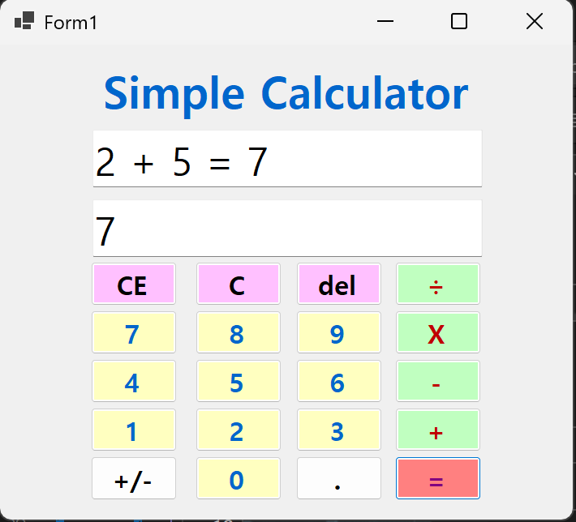
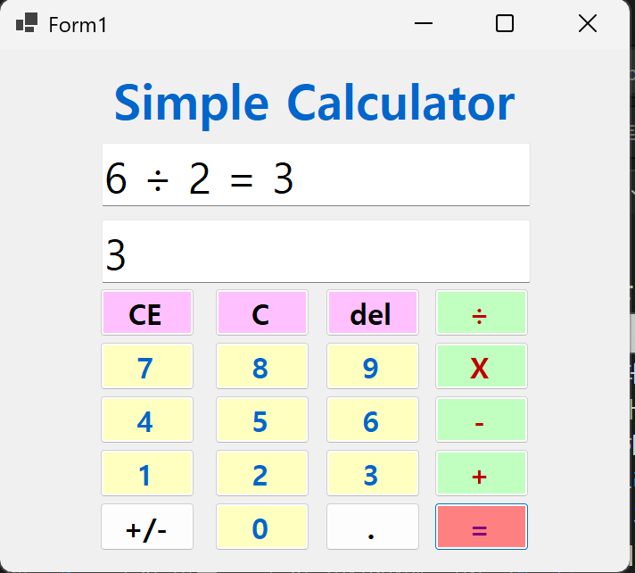
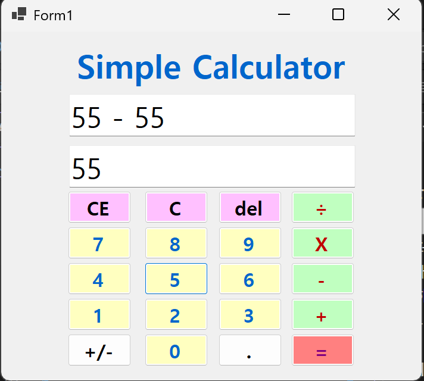
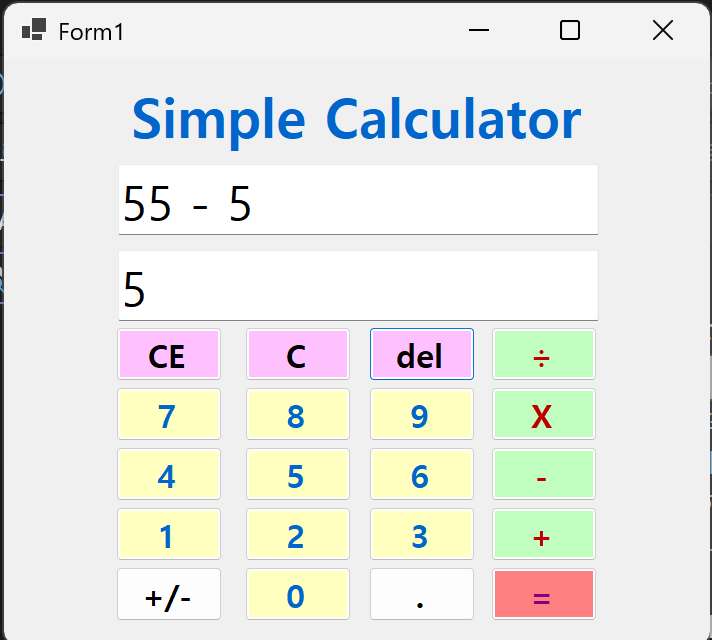
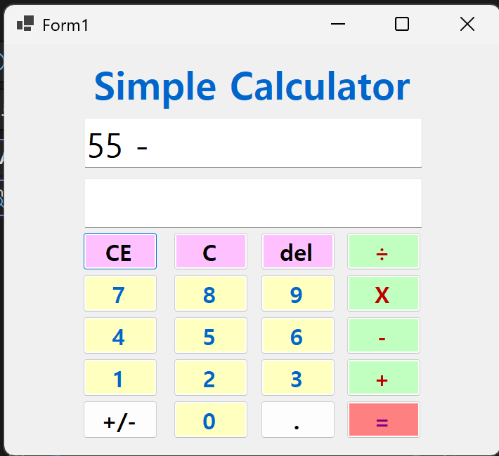
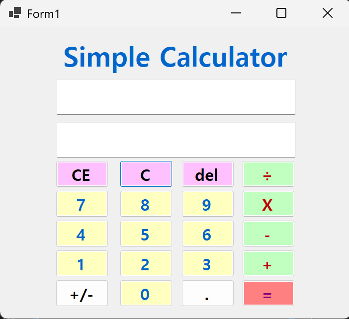
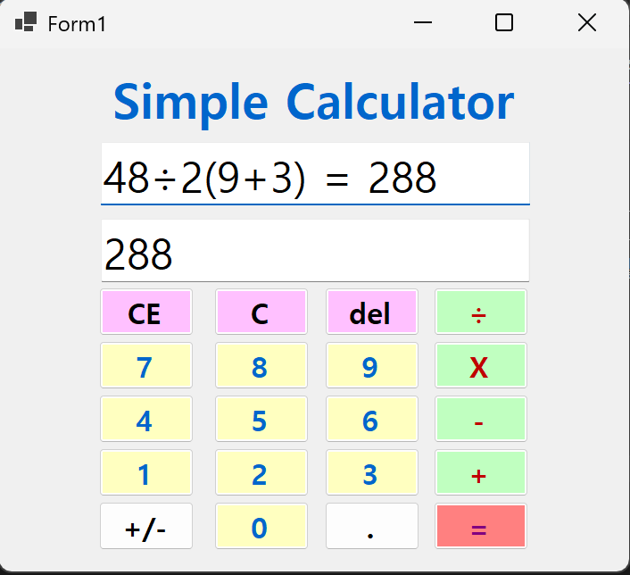

# (C# 코딩) 심플 사칙연산기

## 개요
- C# 프로그래밍 학습
- 1줄 소개: WinForms 기반으로 숫자 입력, 사칙연산 처리, 수정/삭제 기능, 사용자 편의 기능까지 단계적으로 구현한 심플 계산기 프로그램
- 핵심기능:
  1. 두 개의 피연산자를 입력받아 더하기, 빼기, 곱하기, 나누기 연산 수행
  2. 입력 내용 전체 수식과 현재 피연산자/최종 결과를 각각 다른 TextBox에 표시
  3. C, CE, Del 기능을 통한 전체 초기화, 마지막 피연산자 삭제, 마지막 글자 삭제 지원
  4. 계산 결과 직후 새로운 숫자를 입력하면 새 계산이 시작되도록 UX 개선
  5. 불필요한 선행 0 입력 방지 및 연산자 표시 개선(÷, X)
- 화면구성:
  - 상단 Label: 프로그램 제목 표시
  - 상단 TextBox 1: 전체 수식 및 계산 과정 표시
  - 상단 TextBox 2: 현재 입력값 또는 최종 결과 표시
  - 하단 Button 영역: 숫자 버튼, 사칙연산 버튼, C / CE / Del 버튼으로 구성
- 사용한 플랫폼:
  - C#
  - .NET Windows Forms
  - Visual Studio
  - GitHub
- 사용한 컨트롤:
  - Label
  - TextBox
  - Button
- 사용한 기술과 구현한 기능:
  1. Visual Studio를 이용하여 WinForms 계산기 UI를 설계하고 컨트롤을 배치함
  2. TextBox의 문자열 입력값을 `int.Parse()`로 정수형으로 변환하여 사칙연산을 수행함
  3. 계산 결과를 `ToString()`으로 문자열로 변환하여 TextBox에 출력함
  4. `Click` 이벤트를 활용하여 숫자 버튼, 연산자 버튼, C / CE / Del 버튼의 동작을 구현함
  5. `string.Remove()`를 이용하여 마지막 입력 글자 삭제 기능(Del)을 구현함
  6. 상태 변수(`firstOperand`, `secondOperand`, `currentOperator`, `isSecondInput`)를 사용하여 계산 흐름을 제어함
  7. 결과 표시 상태를 별도로 관리하여 계산 완료 후 새 숫자 입력 시 새로운 계산이 시작되도록 개선함
  8. 첫 자리 불필요한 0 입력을 방지하여 `007`, `08`과 같은 형태가 입력되지 않도록 처리함
  9. 내부 계산 연산자와 화면 표시 연산자를 분리하여 나눗셈은 `÷`, 곱셈은 `X`로 보이도록 개선함

##과제 1

## 실행 화면 (과제1)

- 과제1 코드의 실행 스크린샷

## 과제 내용
- TextBox와 Button을 적절히 배치하여 계산기 UI를 구성합니다.
- 숫자 버튼 클릭 시 TextBox에 입력값이 표시되도록 구현합니다.
- 입력 내용을 2가지 방식으로 표시합니다.
- 2개의 피연산자 입력값을 Int로 바꾸어 더하기 계산을 수행합니다.
- 계산 결과를 문자열로 변환하여 화면에 표시합니다.

## 구현 내용과 기능 설명
- **기본 계산기 UI 구성:** 상단에 제목 Label과 두 개의 TextBox를 배치하고, 하단에 숫자 버튼과 `+`, `=` 버튼을 배치하여 계산기의 기본 형태를 구성했습니다.
- **입력값 이중 표시:** 첫 번째 TextBox에는 전체 수식이 표시되도록 하고, 두 번째 TextBox에는 현재 입력 중인 피연산자 또는 최종 결과가 표시되도록 구현했습니다.
- **문자열 → 정수 변환:** TextBox 및 내부 문자열 변수에 저장된 입력값은 그대로는 계산할 수 없기 때문에 `int.Parse()`를 사용하여 정수형으로 변환한 뒤 덧셈을 수행했습니다.
- **정수 → 문자열 변환:** 계산 결과는 `ToString()`을 통해 다시 문자열로 변환하여 TextBox에 출력되도록 구현했습니다.

## 사용한 기술과 구현한 기능
- `TextBox.Text`가 문자열이라는 점을 바탕으로 입력 데이터를 `int.Parse()`로 정수형으로 변환하고, 계산 결과를 `ToString()`으로 출력하는 기본 사칙연산 흐름을 구현했습니다.

## 과제2

## 실행 화면 (과제2)

- 과제2 코드의 실행 스크린샷

(img/img3.png)

(img/img4.png)

## 과제 내용
- 뺄셈(-), 곱셈(*), 나눗셈(/) 버튼을 추가합니다.
- 각 버튼의 Click 이벤트를 연결합니다.
- 각 버튼 클릭 시 연산자만 변경하여 동일한 계산 로직이 적용되도록 구현합니다.

## 구현 내용과 기능 설명
- **사칙연산 확장:** 과제1에서 구현한 덧셈 구조를 그대로 유지하면서, `-`, `*`, `/` 연산자를 추가하여 뺄셈, 곱셈, 나눗셈 기능을 확장했습니다.
- **공통 계산 로직 유지:** `btnEqual_Click()` 내부에서 `currentOperator` 값에 따라 연산 종류만 분기 처리하고, 나머지 계산 흐름은 동일하게 유지하도록 구현했습니다.
- **입력 흐름 재사용:** 각 연산자 버튼은 클릭 시 `currentOperator` 값만 바꾸고 `isSecondInput` 상태를 변경하여 두 번째 피연산자를 입력받도록 만들었습니다.

## 사용한 기술과 구현한 기능
- `if`, `else if` 분기문을 사용해 `currentOperator` 값에 따라 더하기, 빼기, 곱하기, 나누기 연산이 실행되도록 구현했습니다.

## 과제 3

## 실행 화면 (과제3)

- 과제3 코드의 실행 스크린샷

## 과제 내용
- `C` 버튼으로 현재의 모든 내용을 삭제하고 초기 상태로 되돌립니다.
- `CE` 버튼으로 마지막 피연산자 값을 한 번에 삭제합니다.
- `Del` 버튼으로 마지막 입력 글자 1개를 삭제합니다.

## 구현 내용과 기능 설명
- **전체 초기화(C):** `firstOperand`, `secondOperand`, `currentOperator`, 입력 상태 변수 값을 모두 초기화하고 두 TextBox의 내용을 비워 계산기 전체를 초기 상태로 되돌리도록 구현했습니다.
- **마지막 피연산자 삭제(CE):** 현재 첫 번째 피연산자를 입력 중인지, 두 번째 피연산자를 입력 중인지에 따라 마지막 피연산자 전체를 삭제하도록 처리했습니다.
- **마지막 글자 삭제(Del):** `string.Remove()`를 사용하여 입력 문자열의 마지막 글자 1개만 삭제하고, 변경된 값을 두 TextBox에 다시 반영하도록 구현했습니다.
- **예외 방지:** 문자열 길이가 0일 때 삭제가 실행되지 않도록 조건문을 추가하여 불필요한 오류를 방지했습니다.

## 사용한 기술과 구현한 기능
- `string.Remove()`와 조건문을 이용하여 마지막 글자 삭제 기능을 구현하고, 상태 변수에 따라 C / CE / Del 기능이 올바르게 동작하도록 제어했습니다.

## 과제4

## 실행 화면 (과제4)

## 과제 내용
- 키보드만으로도 계산기 입력이 가능하도록 구현합니다.
- 괄호를 포함한 수식을 입력할 수 있도록 기능을 추가합니다.
- 괄호가 가장 먼저 계산되고, 그 다음 곱하기와 나누기, 마지막으로 더하기와 빼기가 계산되도록 연산 우선순위를 반영합니다.
- 일반적인 계산기처럼 수식 전체를 입력한 뒤 결과를 확인할 수 있도록 개선합니다.

## 구현 내용과 기능 설명
- **키보드 입력 지원:** 숫자 키와 연산자 키를 마우스 클릭 없이 바로 입력할 수 있도록 구현하여 사용 편의성을 높였습니다. 이를 통해 사용자는 버튼을 직접 누르지 않고도 수식을 빠르게 입력할 수 있습니다.
- **괄호 입력 기능 추가:** 계산식에 여는 괄호 `(` 와 닫는 괄호 `)` 를 입력할 수 있도록 하여, 사용자가 원하는 계산 순서를 직접 지정할 수 있게 했습니다.
- **연산자 우선순위 반영:** 계산 로직에서 괄호를 가장 먼저 처리하고, 그 다음 곱하기와 나누기, 마지막으로 더하기와 빼기가 수행되도록 구현했습니다. 이를 통해 `2+4*2-1` 과 같은 식은 일반적인 수학 규칙에 따라 계산되며, `(2+4)*2-1` 과 같은 괄호식도 올바르게 동작하도록 만들었습니다.
- **전체 수식 기반 계산 방식 개선:** 기존처럼 두 개의 피연산자만 처리하는 방식이 아니라, 사용자가 입력한 전체 수식을 기준으로 계산이 이루어지도록 개선하여 실제 계산기와 비슷한 사용 경험을 제공하도록 구현했습니다.

## 사용한 기술과 구현한 기능
- `KeyPress`, `KeyDown`, `KeyPreview`를 활용하여 마우스 클릭 없이도 숫자, 연산자, 괄호, Enter, Backspace, Escape 입력이 가능하도록 키보드 중심 입력 기능을 구현했습니다.
- 사용자가 입력한 계산식을 문자열(`expression`)로 누적 저장하고, 이를 기반으로 전체 수식을 한 번에 해석하는 방식으로 계산 구조를 확장했습니다.
- 괄호, 곱셈/나눗셈, 덧셈/뺄셈의 우선순위를 올바르게 반영하기 위해 수식 토큰화(Tokenizing), 연산자 우선순위 판별, 후위 표기식(RPN) 변환 및 스택 기반 계산 로직을 직접 구현했습니다.
- `List`, `Stack`, `switch` 식, `double.TryParse()`, `CultureInfo.InvariantCulture` 등을 활용하여 숫자 판별과 연산 처리의 안정성을 높였습니다.
- 내부 계산 로직에서는 `*`, `/` 기호를 사용하고, 화면 출력 시에는 `X`, `÷`로 변환하여 계산 정확성과 사용자 가독성을 동시에 고려했습니다.
- 계산 결과가 표시된 이후 새로운 입력이 들어오면 기존 결과 뒤에 값이 이어붙지 않고 새 수식이 시작되도록 상태 변수(`isResultDisplayed`)를 활용해 입력 흐름을 제어했습니다.